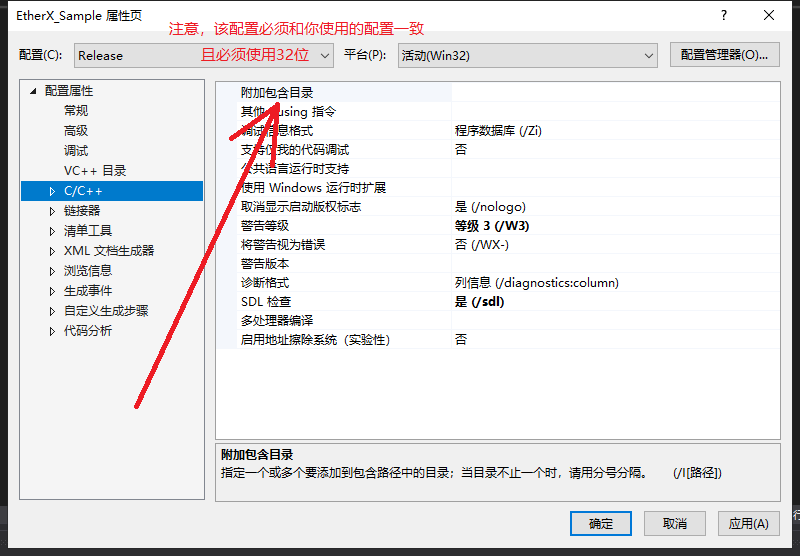
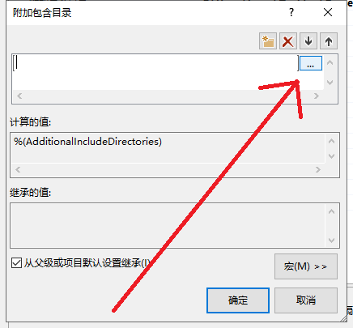
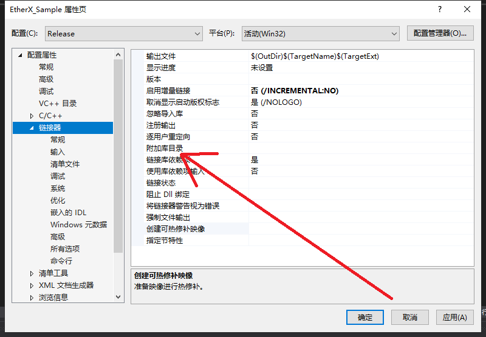

# EtherX静态库链接

这里，我们使用[Visual Studio 2019 Professional](https://visualstudio.microsoft.com/zh-hans/vs/)作为示例

首先，创建一个空项目，右键项目，选择`属性`

然后选择`C/C++`，并注意到我们的`附加包含目录`

选择`编辑`，并点击图中所示的`...`，将`EtherX.h`添加进来

OK，现在头文件包含进来了，下一步让我们将.lib静态库链接进来吧！
选择`链接器`，并注意到`附加库目录`，在这里只需要像刚才添加`EtherX.h`的方法一样将`EtherX.lib`添加进来即可

最后，展开`链接器`，选择`输入`，并在`附加依赖项`里面输入`EtherX.lib;`，注意用分号隔开嗷！

接下来，我们就成功将`EtherX`链接进了我们的编译器，准备好开始写程序吧！

# [返回](../quick-start.md)